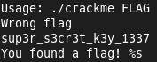
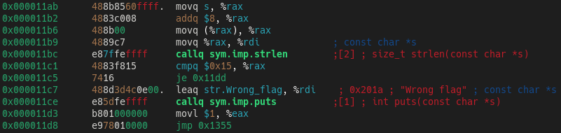
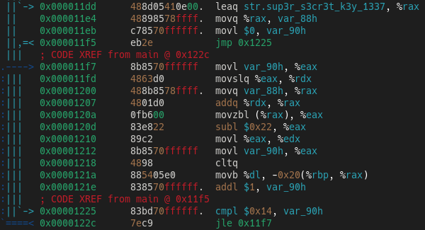
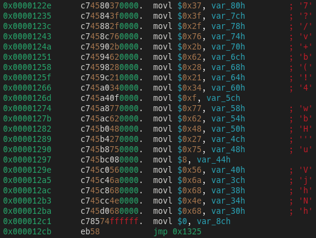
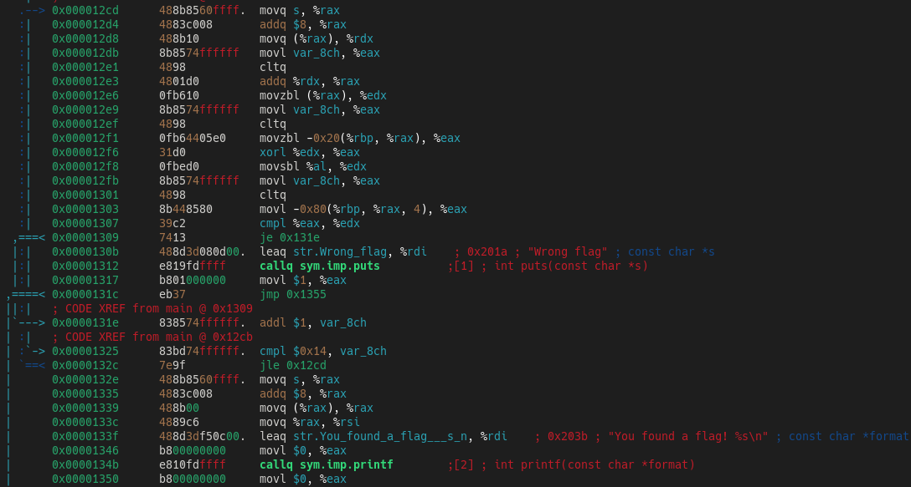
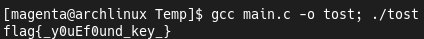
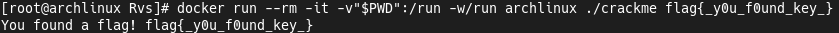

## "Find A Real Key" Challenge
[Challenge](https://crackmes.one/crackme/629e1e5833c5d4251e72375f) found on [crackmes.one](https://crackmes.one).  
My [profile](https://crackmes.one/user/_Magenta_) on this site.  
To solve this challenge i used [Radare2](https://github.com/radareorg/radare2).

### Solution

First of all, i tried to check binary's strings.  
We see program's messages and some key, remember that.  
  
But if we put this secret key to program it fails.  
  
Now let's analyse binary with Radare2.  
We have default set of functions, so we go to `sym.main`.  
  
First interesting part is the check `argv [1]` string's lenght.  
As we remember, first argument is the our flag.  
  
If we check a lenght of the strange secret key, it will be `21 (0x15)`.  
  
Next part looks like the `for () {}` statement.  
It substract `0x22` from all secret key's characters, and writing result to `RBP - 0x20`, remember that.  
  
  
Next code initialize array with the same lenght and some bytes in `RBP - 0x80`.  
  
  
And most important part of the function...  
It's again the `for () {}` loop.  
This code get our `argv [1]` string and `RBP - 0x20` bytes and XOR it!  
As we remeber, `RBP - 0x20` it's a secret key characters substracted by `0x22`.  
After that it compare XOR result with bytes array, initialized before in `RBP - 0x80`.  
  
  
To resolve this challenge i'm wrote small C program.
```c
#include <stdio.h>

char fst_flag_prt [] = "sup3r_s3cr3t_k3y_1337",
     snd_flag_prt [] = "7?/v+b(!4\x15wbH'u\x08VjhNh";

int main (void) {
    int i;

    for (i = 0; i < sizeof (fst_flag_prt) / sizeof (char); fst_flag_prt [i] -= 0x22, ++i);

    for (i = 0; i < sizeof (fst_flag_prt) / sizeof (char); ++i) {
        printf ("%c", fst_flag_prt [i] ^ snd_flag_prt [i]);
    } puts ("");

    return 0;
}
```  
  
And we see the flag! But 10th character looks strange, let's change it...  
  
  
If we try it now, we'll see that the flag is correct!  


### Conclusion
I think is a great challenge for beginners.  
It is a good opportunity to practice skills in static analysis and understanding low-level code flow.

