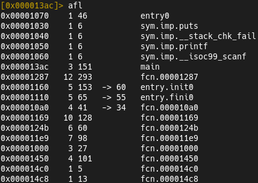
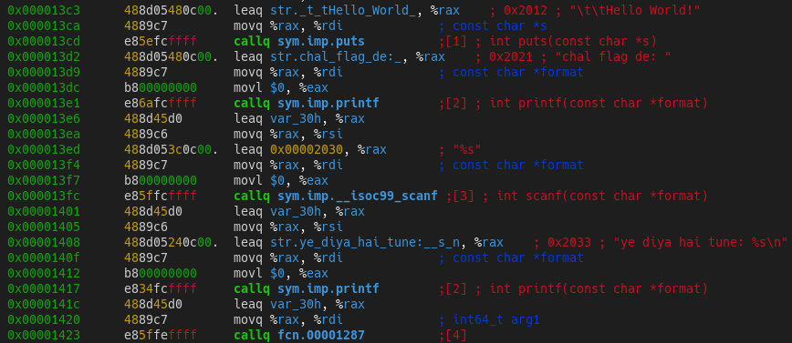
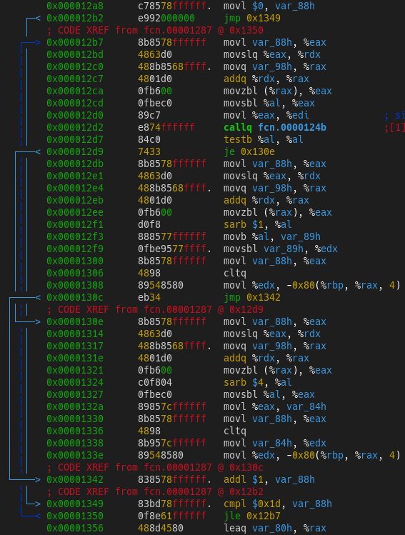
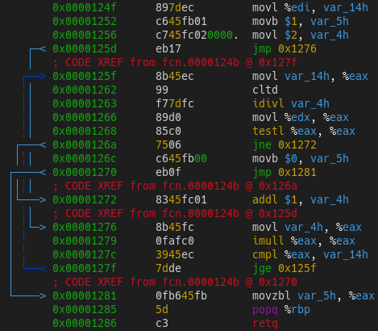
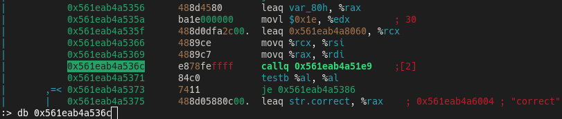
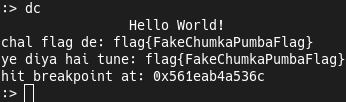
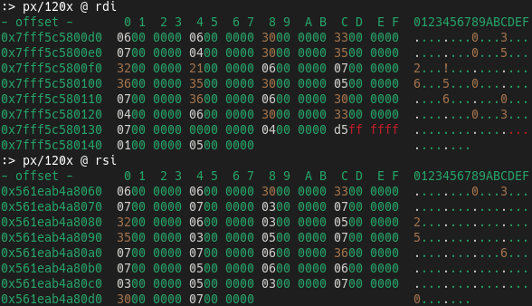
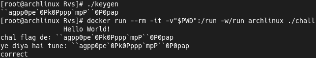

## "Hash Checker 0x01" Challenge
[Challenge](https://crackmes.one/crackme/622db5be33c5d46c8bcc027f) found on [crackmes.one](https://crackmes.one).  
My [profile](https://crackmes.one/user/_Magenta_) on this site.  
To solve this challenge i used [Radare2](https://github.com/radareorg/radare2).

### Solution
In start we can try to check binary's string, but nothink useful yet.  
Let's move to Radare2 and view list of the binary's functions.  
  
In this case we have few undefined functions...  
But let's start analysis from the `main ()` function.  
  
It's trying to get flag string from input and passing it to some undefined function.  
  
  
This function have some `for () {}` loop and looks line it's encoding our input...  
  
  
But in the loop we see calling of the other undefined function...  
Let's check it out!  
It looks like more encodings or some check.  
In this function we see `idivl` and `imull` instructions, let's just remember that.  
  
  
Let's just skip next big part of function and check end condition.  
We have another undefined function that takes 3 prameters...  
First parameters is the our encoded input string.  
But the second parameter it's a some memory address.  
Third parameter it's just flag lenght `30 (0x1E)`.  
It looks like the functions compares our encoded input string with the hash (flag).  
Now let's debug binary with radare2! Set the breakpoint before calling this function...  
  
  
Let's enter the fake flag for example.  
  
  
Now let's get step to the function and read first two function's parameters.  
It's looks like ints array... And we have some matches in the buffers!  
  
  
This first 5 bytes is the our "**flag{**" piece of string.  
Now, let's try to understand how `0x66 0x6C 0x61 0x67 0x7B` converted to `0x06 0x06 0x30 0x33 0x07`...  
As we remember it uses `idivl` and `imull` instructions.  
And after few attempts dividing numbers i understand how it works.  
If the character's number is even, algorithm will be `number / 2 / 4 / 2`.  
Buf if it's odd, algorithm will be `nubmer / 2`...  
Now we can dump encoded flag bytes and write the keygen!  
```c
#include <stdio.h>

char unhash (int);

const char hash [] = { 0x06, 0x06, 0x30, 0x33, 0x07, 0x07, 0x03, 0x07,
                       0x32, 0x06, 0x03, 0x05, 0x35, 0x03, 0x05, 0x07,
                       0x07, 0x07, 0x06, 0x36, 0x07, 0x05, 0x06, 0x06,
                       0x03, 0x05, 0x03, 0x07, 0x30, 0x07 };

int main (void) {
    int i;

    for (i = 0; i < sizeof (hash) / sizeof (char) /* But If `char` More Than One Byte..? */; ++i)
        printf ("%c", unhash (hash [i]));
    puts (""); /* Line Feed */

    return 0;
}

char unhash (int c) {
    if (c * 2 * 4 * 2 > 128) {
        return (c * 2) + 1;
    } else {
        return c * 2 * 4 * 2;
    }
}
```  
  
Let's check the keygen. Yeah, It's working!  


### Conclusion
Good challenge to start in RE and writing keygens.  
This challegent shows how important dynamic analysis.

