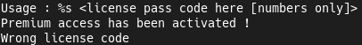
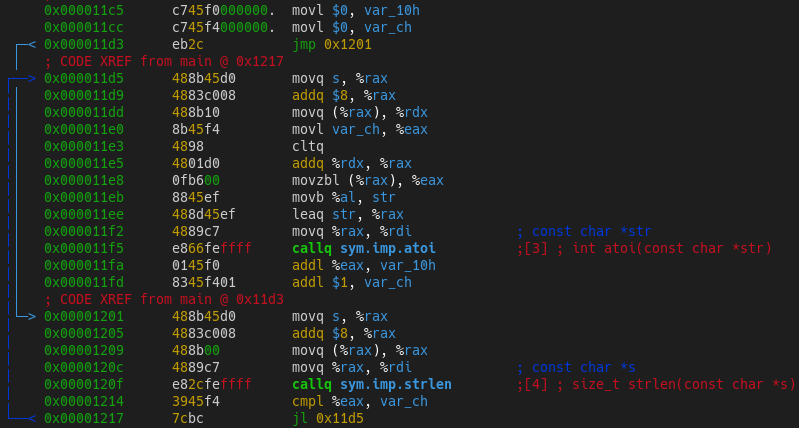
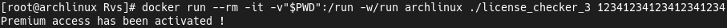
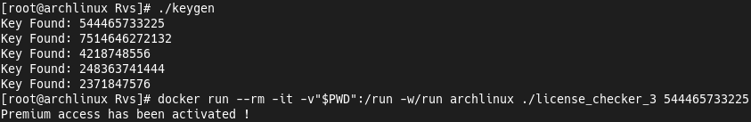

## "License Checker 0x03" Challenge
[Challenge](https://crackmes.one/crackme/62072dd633c5d46c8bcbfd9b) found on [crackmes.one](https://crackmes.one).  
My [profile](https://crackmes.one/user/_Magenta_) on this site.  
To solve this challenge i used [Radare2](https://github.com/radareorg/radare2).

### Solution
For start, let's try to check binary's strings.  
But nothing useful there...  
  
  
Now we move to the Radare2.  
There we see standard functions and go to `main ()`.  
This is so small function!  
Scroll down and we see `for () {}` loop.  
  
In start loop it's getting `argv [1]` byte by byte.  
After that, program converting each byte to int with `atoi ()` (The acronym for **ASCII To Int**).  
And in the end it compare sum of the ints with `50 (0x32)`!  
  
Let's check it!  
We can get `1 + 2 + 3 + 4` sum and repeat it for 5 times.  
And it's working!  
  
  
Now let's write keygen!
```c
#include <stdio.h>
#include <stdlib.h>
#include <time.h>

#define MAX_KEY_LEN 20
#define MAX_KEYS 5

int check_key (void);
void print_key (void);

int num_sequence [MAX_KEY_LEN];

int main (void) {
    srand (time (0));
    check_key ();

    return 0;
}

int check_key (void) {
    int i, j, l, t, sum;

    for (t = 0, i = 0;; ++i) {
        l = (rand () % 8) + 1;
        num_sequence [i] = l;
        sum += l;
        if (sum == 0x32) {
            print_key ();
            for (j = 0; j < MAX_KEY_LEN; num_sequence [j] = 0, ++j);
            sum = 0;
            i = -1;

            if (++t > MAX_KEYS - 1) break;
        } else if (i >= MAX_KEY_LEN || sum > 0x32) {
            for (j = 0; j < MAX_KEY_LEN; num_sequence [j] = 0, ++j);
            sum = 0;
            i = -1;
        }
    }
}

void print_key (void) {
    printf ("Key Found: ");
    for (int i = 0; i < MAX_KEY_LEN && num_sequence [i]; ++i)
        printf ("%d", num_sequence [i]);
    puts (""); /* Line Feed */
}
```  
  
Let's try it... And it works!  


### Conclusion
This keygen is not most optimized but it's just example.  
It's a good challenge to start in RE and writing exploits.
