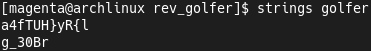
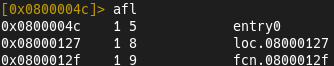
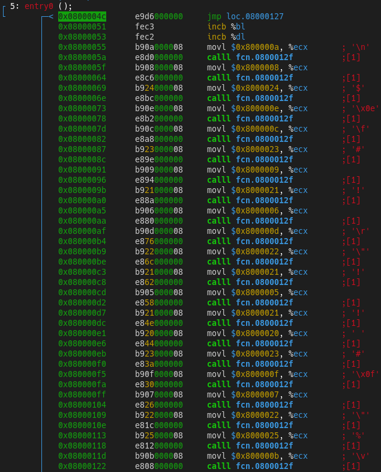
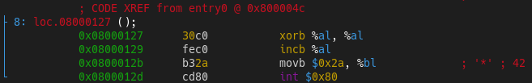
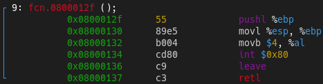
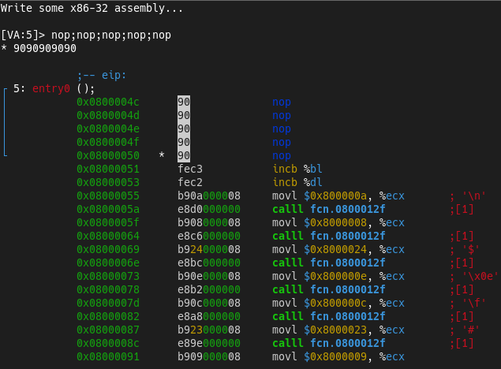
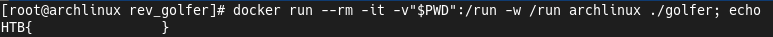

## "Golfer - Part 1" Challenge
[Challenge](https://app.hackthebox.com/challenges/378) found on [HackTheBox](https://hackthebox.eu).  
My [profile](https://app.hackthebox.com/profile/410052) on this site.  
To solve this challenge i used [Radare2](https://github.com/radareorg/radare2).

### Solution
We have a so small binary (Only 312 bytes).  
Let's check the strings...  
  
  
We found two strings looks like some encoded bytes.  
Now we move in Radare2 and check the functions list.  
  
  
In this list we see entry point, some function and goto location.  
Let's start from entry point.  

  
First instruction it's a jump to the some address.  
In this address we have a `exit ()` syscall.  
  
  
After that it's moving to function that invoke a `write ()` syscall.  

  
Jump instruction in the entry point bypasses writing some bytes.  
Let's patch the binary and replace `jmp` with `nop`.  
  
  
Now we can to run the binary and check a result. We got the flag.  
  
  
### Conclusion
This is so easy challege.  
But it shows the one of a ways to objective - patching.
