## Reverse Engineering Challenges
[Challenges](https://dojo.pwn.college/challenges/reversing) found on [dojo.pwn.college](https://dojo.pwn.college/).  
To solve this challenges i used [Radare2](https://github.com/radareorg/radare2).

### Solved Levels
- [Level 0x00](#level-0x00)
- [Level 0x01](#level-0x01)
- [Level 0x02](#level-0x02)
- [Level 0x03](#level-0x03)
- [Level 0x04](#level-0x04)
- [Level 0x05](#level-0x05)
- [Level 0x06](#level-0x06-0x07)
- [Level 0x07](#level-0x06-0x07)

### Level 0x00
Let's run it and enter fake key.  
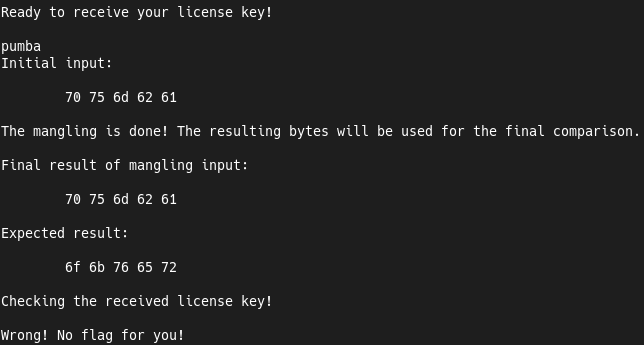  
  
As we can see, our input is printed in HEX format.  
And below it displays the key we need.  
To convert HEX to ASCII we can use `rax2 -s` command.  
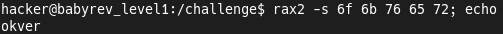  
  
Now we can to solve this challenge with the valid key.  
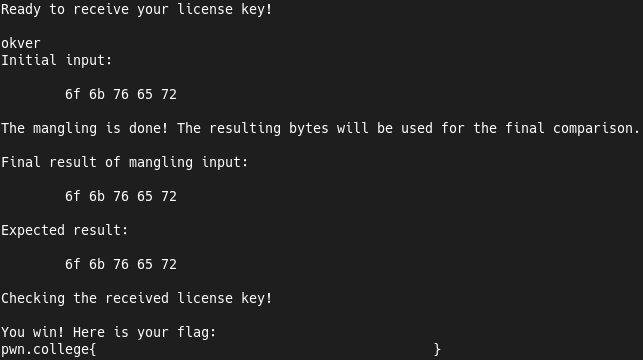  

### Level 0x01
Let's run it and enter fake key.  
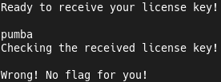  
  
But now it's not printing key for us.  
Let's check it in Radare2.  
Skip some undefined functions and move to the end of a `main ()` function.  
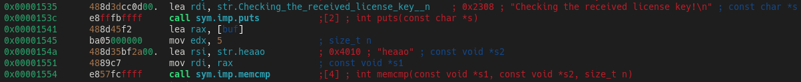  
  
We see piece of the code that checks the key.  
Second `memcmp ()` function's parameter is the our key.  
Let's try to use it.  
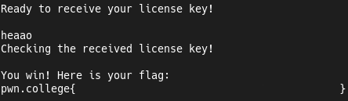

### Level 0x02
Let's run it and enter fake key.  
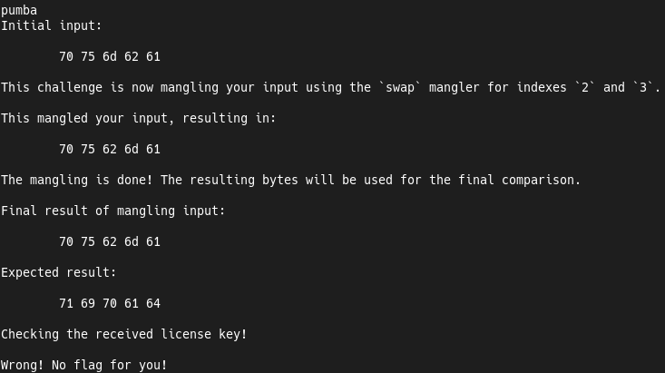  
  
This is similar to what we saw in the [Level 0x00](#level-0x00).  
But now it's just swap two characters.  
Just repeat this trick and swap this characters.  
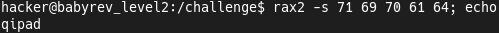  
  
Now let's try it.  
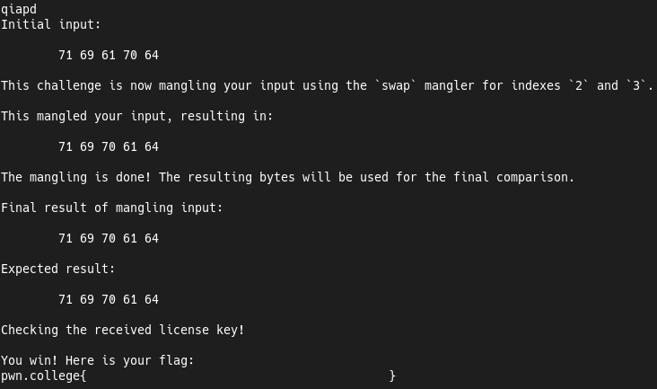

### Level 0x03
Now we'll now see any useful things in the output.  
Let's move to Radare2 and view key check.  
In this case we have swap of the two last characters.  
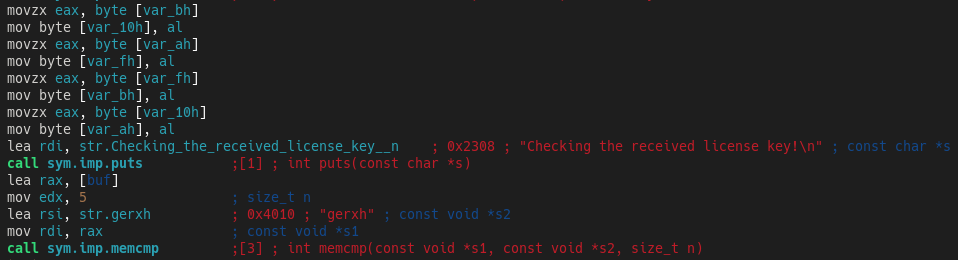  
  
We can get the string and just swap this characters.  
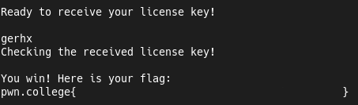

### Level 0x04
This level swap all characters.  
Let's convert and swap it...  
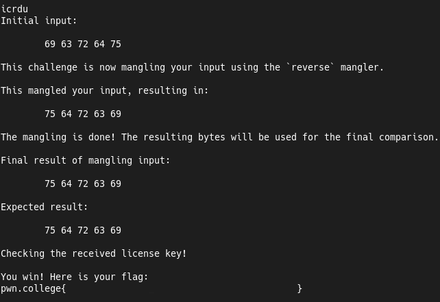

### Level 0x05
Nothing useful is printed at the start.  
We can check the algorithm in Radare2.   
In this case it's again swap all characters.  
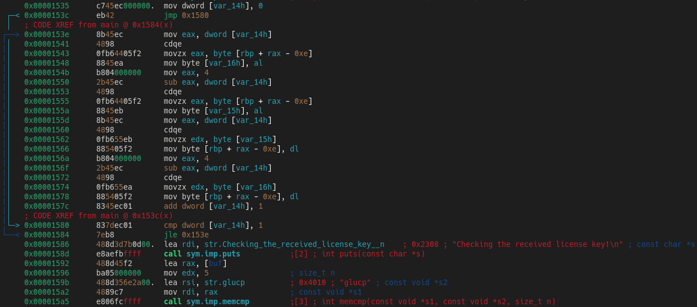  
  
Let's get this string and swap it.  
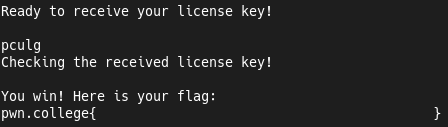

### Level 0x06 0x07
In this 2 levels we see sort algorithm.  
And so we can just get string from comparision condition, like in [Level 0x01](#level-0x01).

### Level 0x08
In this level we see XOR encoding.  
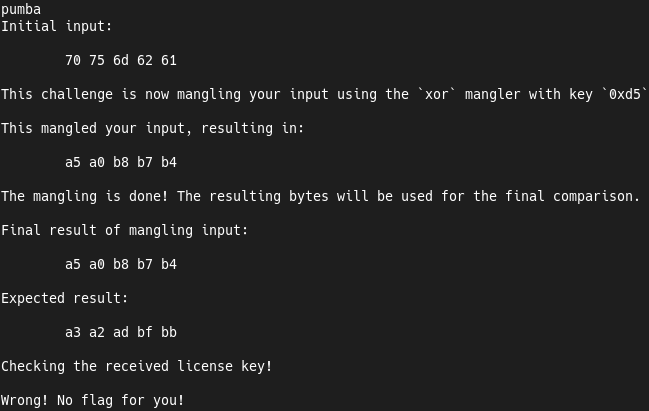  
  
Program show us the encoding key.  
Let's use one small trick to decode it.  
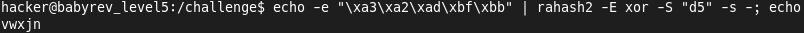  
  
And with this string we can to solve this challenge.  
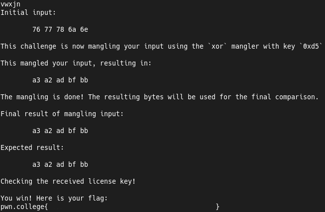

