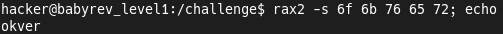

## Reverse Engineering Challenges
[Challenges](https://dojo.pwn.college/challenges/reversing) found on [dojo.pwn.college](https://dojo.pwn.college/).  
To solve this challenges i used [Radare2](https://github.com/radareorg/radare2).

### Solved Levels
- [Level 0x01](#level-0x01)

###Level 0x01
Let's run it and enter fake key.  
  
  
As we can see, our input is printed in HEX format.  
And below it displays the key we need.  
To convert HEX to ASCII we can use `rax2 -s` command.  
  
  
Now we can to solve this challenge with the valid key.  
  

