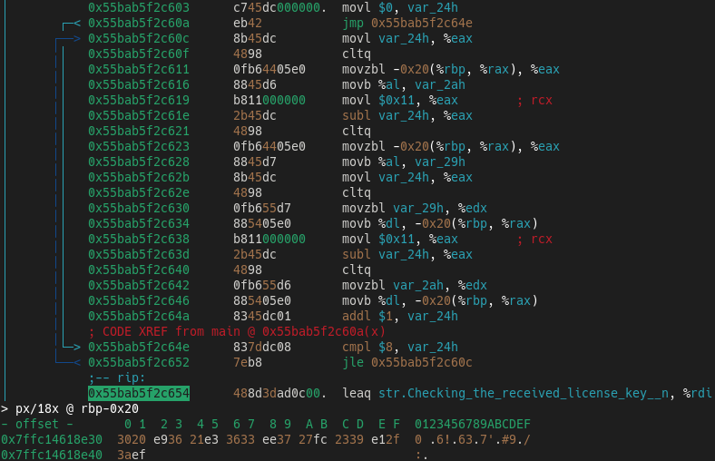

## Reverse Engineering Challenges
[Challenges](https://dojo.pwn.college/challenges/reversing) found on [dojo.pwn.college](https://dojo.pwn.college/).  
To solve this challenges i used [Radare2](https://github.com/radareorg/radare2).

### Solved Levels
- [Level 0x00](#level-0x00)
- [Level 0x01](#level-0x01)
- [Level 0x02](#level-0x02)
- [Level 0x03](#level-0x03)
- [Level 0x04](#level-0x04)
- [Level 0x05](#level-0x05)
- [Level 0x06](#level-0x06-0x07)
- [Level 0x07](#level-0x06-0x07)
- [Level 0x08](#level-0x08)
- [Level 0x09](#level-0x09)
- [Level 0x0A](#level-0x0A)
- [Level 0x0B](#level-0x0B)

### Level 0x00
Let's run it and enter fake key.  
  
  
As we can see, our input is printed in HEX format.  
And below it displays the key we need.  
To convert HEX to ASCII we can use `rax2 -s` command.  
  
  
Now we can to solve this challenge with the valid key.  
  

### Level 0x01
Let's run it and enter fake key.  
  
  
But now it's not printing key for us.  
Let's check it in Radare2.  
Skip some undefined functions and move to the end of a `main ()` function.  
  
  
We see piece of the code that checks the key.  
Second `memcmp ()` function's parameter is the our key.  
Let's try to use it.  

### Level 0x02
Let's run it and enter fake key.  
  
  
This is similar to what we saw in the [Level 0x00](#level-0x00).  
But now it's just swap two characters.  
Just repeat this trick and swap this characters.  
  
  
Now let's try it.  

### Level 0x03
Now we'll now see any useful things in the output.  
Let's move to Radare2 and view key check.  
In this case we have swap of the two last characters.  
  
  
We can get the string and just swap this characters.  

### Level 0x04
This level swap all characters.  
Let's convert and swap it...  

### Level 0x05
Nothing useful is printed at the start.  
We can check the algorithm in Radare2.   
In this case it's again swap all characters.  
  
  
Let's get this string and swap it.  

### Level 0x06 0x07
In this 2 levels we see sort algorithm.  
And so we can just get string from comparision condition, like in [Level 0x01](#level-0x01).

### Level 0x08
In this level we see XOR encoding.  
  
  
Program show us the encoding key.  
Let's use one small trick to decode it.  
  
  
And with this string we can to solve this challenge.  

### Level 0x09
We see same algorithm as in [Level 0x08](#level-0x08).  
Now we move to Radare2 and check last part of `main ()`.  
  
  
We can use same trick as in previous [level](#level0x08).  
  
  
And now we see the flag.  

### Level 0x0A
At this level we see a more complex bytes encoding.  
  
  
To decode this we can use following command.  
  
  
Now let's try it.  

### Level 0x0B
Now we don't have any useful output from the program.  
But if we check a `main ()` function we'll see that it's so complex.  
We have only key lenght `18 (0x12)`.  
Let's write our input to temp file and debug a program with Radare2.  
  
  
I'm set a breakpoint to first piece of code which modify our input.  
  
  
Now we continue program execution.  
If we look to previous screenshot more closely we can see address of our input.  
Let's check it out.  
  
  
After that we can to continue.  
Skip the next piece of code and check our input string again.  
  
  
We see that two characters is swaped.  
Their indexes are `2` and `8`, let's remember that.  
Next piece of code it's a `for () {}` loop.  
  
  
Let's move in...  
I'm skip instructions before `cmp`.  
Now `EAX` equals `0` and we move to this check.  
  
  
There we have a XOR first byte with `0x8C`.  
  
  
After that we move to new iteration and `EAX` is `1`.  
Now we have this check.  
  
  
And it's jumps to next XOR-ing part, in this case XOR will be with `0x52`.  
  
  
Now our `EAX` is `2` and we move to the next check.  
  
  
It move us to another XOR-ing piece of code, now XOR with `0x42`.  
  
  
After that, pattern will be same.  
XOR key is the `0x8C 0x52 0x42`.  
The next piece of code it's again `for () {}` loop.  
Let's just skip it and check the result.  
As we can see, this code reverse our bytes.  
  
  
And we can see memory comparision.  
Let's dump address of encoded key buffer and write it in reverse order.  
After that we need to make an XOR it with this bytes `0x8C 0x52 0x42`.  
  
  
Now we need to swap the second and the eighth characters.  
And then, we can get the flag.  
  

