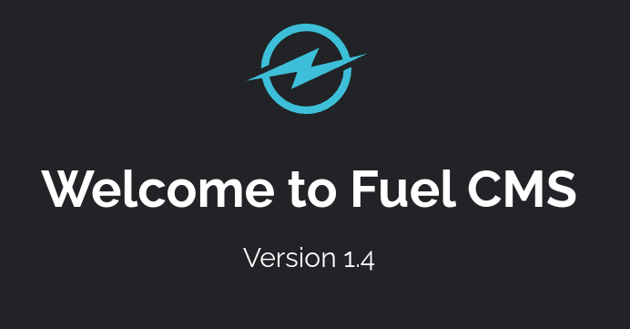
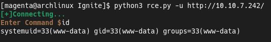
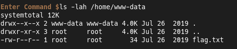
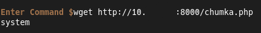
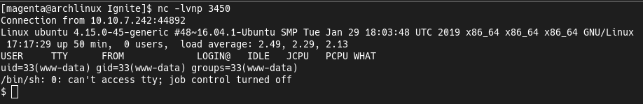
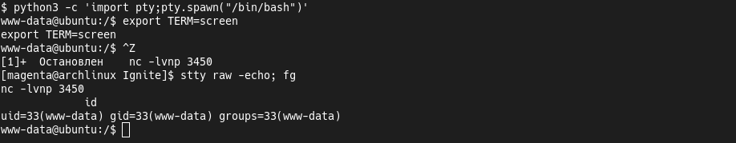
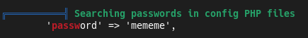
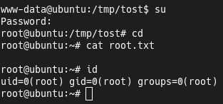

## "Ignite" Machine
[Machine](https://tryhackme.com/room/ignite) found on [tryhackme.com](https://tryhackme.com).  
My [profile](https://tryhackme.com/p/0Magenta0) on this site.  
To solve this challenge i used [ExploitDB](https://exploit-db.com) and [LinPEAS](https://github.com/carlospolop/PEASS-ng/tree/master/linPEAS).

### Solution
Nmap scan shows us that only the 80th port is open.  
Let's check home page of this website.  
We have a some install instructions, credentials for admin panel and the version of this service.  
  
  
Now i'm search about exploits for the running service.  
To get the foothold we can to use this [RCE script](https://www.exploit-db.com/exploits/50477).  
  
  
In this case we see that `www-data` user is have the home directory.  
Directory contains only the user flag.  
  
  
Next i'm upload [PHP reverse shell](https://pentestmonkey.net/tools/web-shells/php-reverse-shell) to the server.  
  
  
After that i visit to this page and get the reverse shell.  
  
  
Now we can to spawn a full TTY shell.  
  
  
Let's upload the [LinPEAS](https://github.com/carlospolop/PEASS-ng/tree/master/linPEAS) and run it.  
And i'm noticed that in this case directory caching is so slow.  
After long scan and large output we can see that the system is vulnerable to a few PE exploits.  
But if we look to it more closely we'll can notice that we have password in the some PHP file.  
  
  
We can try this password to the `root` user, and we did it, we got a root shell.  
Move to the home directory and we can to read the root flag.  
  

### Conclusion
It's a easy machine but it shows that we can have a lot of ways to a root.
