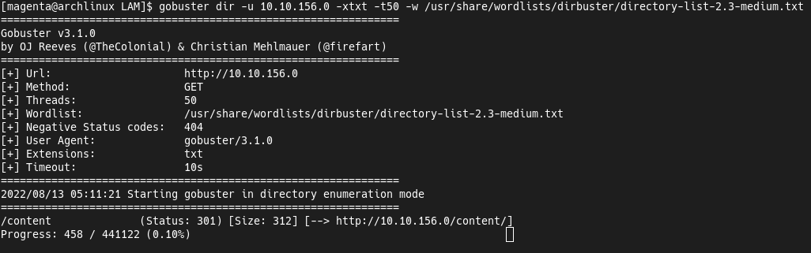

## "LazyAdmin" Machine
[Machine](https://tryhackme.com/room/lazyadmin) found on [tryhackme.com](https://tryhackme.com).  
My [profile](https://tryhackme.com/p/0Magenta0) on this site.  
To solve this challenge i used [Gobuster](https://github.com/OJ/gobuster) and [Nmap](https://github.com/nmap/nmap).

### Solution
After Nmap scan we have a open SSH, HTTPD and two some filtered ports.  
Firstly let's run a Gobuster to enumerate web servers directories.  
  
  
We have a some directory.  
Let's start a scan to this one.  
  
  
First of all i'am check the changelog.  
We see that it's a some SweetRice CMS 1.5.0.  
  
  
Now let's check the CMS files in the `/content/inc` directory.  
  
  
If we look to this list more closely we can see some MySQL backups.  
  
  
In this database file we can to find the login credentials to the CMS.  
Password will be in a MD5 hash format.  
We can to put this hash to [Crackstation](https://crackstation.net) for example and get the password.  
Now let's move to the `/content/as` directory and login to the CMS admin panel.  
  
  
After that we need to upload the [PHP Reverse Shell](https://pentestmonkey.net/tools/web-shells/php-reverse-shell).  
To do this let's move to create a post page in the CMS.  
Note that in this case we see 1.5.1 version.  
  
  
At the bottom of a page we can to attach file to the post.  
Let's pack the payload to the ZIP archive.  
  
  
Now we can to upload it.  
  
  
If we put mouse cursor over the file, we'll see a link to it.  
After that let's start a TCP listener and just open the uploaded file.  
  
  
We need to spawn a full TTY shell, let's do this.  
In this case i'm do a mistake in the last command and you need to use a `stty raw -echo; fg`.  
  
  
Now let's move to a some user's home directory.  
We have a few interesting files.  
It's a user flag, MySQL history and credentials and the Perl script.  
In this case i'm just skip a MySQL files and check this script.  
  
  
This runs a some another script in a `/etc` directory.  
Let's check the permissions of this script.  
  
  
We can to read and write this one.  
Let's check what this script contains.  
  
  
And it's a some reverse shell.  
We just need to change IP and port in this file to get a new reverse shell.  
In the sudoers file we have a interesting thing.  
We can to run the backup script at root user without password.  
  
  
Let's start another TCP listener and run this script.  
  

### Conclusion
This is easy box but i'm enjoy with it.  
It's a good machine to get a red team web fundamentals.  

