## "Startup" Machine
[Machine](https://tryhackme.com/room/startup) found on [tryhackme.com](https://tryhackme.com).  
My [profile](https://tryhackme.com/p/0Magenta0) on this site.  
To solve this challenge i used [Gobuster](https://github.com/OJ/gobuster) [Nmap](https://github.com/nmap/nmap) and [Termshark](https://github.com/gcla/termshark).

### Solution
From the Nmap scan we have FTP, SSH and HTTP services.  
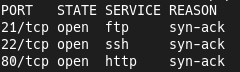  
  
First of all let's check the FTP Anonymous account.  
But we don't have anything useful here.  
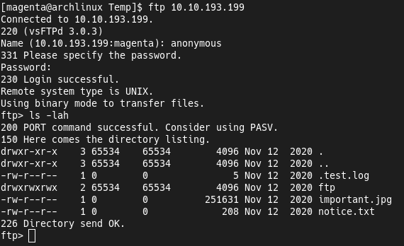  
  
After that i'm check the Web page and here too we don't see some useful things.  
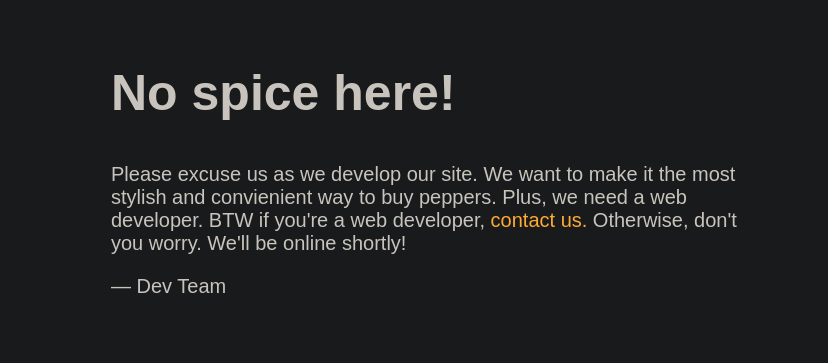  
  
Gobuster scan shows us one interesting directory.  
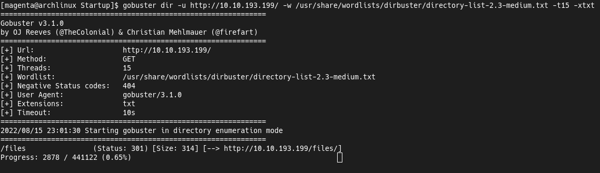  
  
This directory contains the same files as on FTP.  
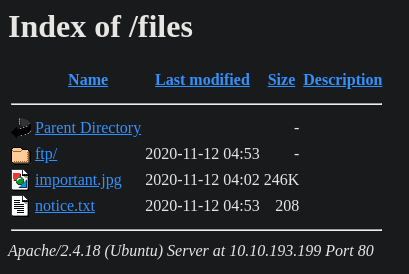  
  
Let's upload a [PHP Reverse Shell](https://pentestmonkey.net/tools/web-shells/php-reverse-shell) to the FTP directory.  
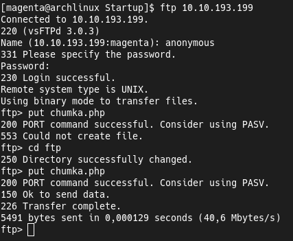  
  
Now we can to run the TCP listener and get the foothold reverse shell.  
And firstly we need to upgrade this shell to a full TTY.  
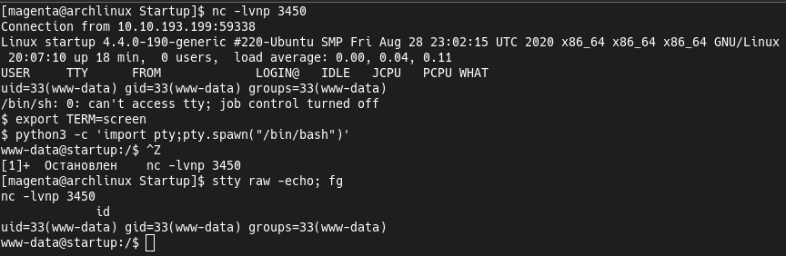  
  
We have a some user's home directory but don't have a permission to it.  
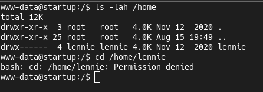  
  
Also the [LinPEAS](https://github.com/carlospolop/PEASS-ng/tree/master/linPEAS) shows us a some interesting files in the root of the filesystem.  
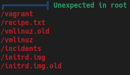  
  
In the `recipe.txt` file we have the answer to one of the machine questions.  
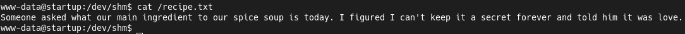  
  
Another file is the packet capture format.  
We can read this format with the [Wireshark](https://gitlab.com/wireshark/wireshark) or [Termshark](https://github.com/gcla/termshark).  
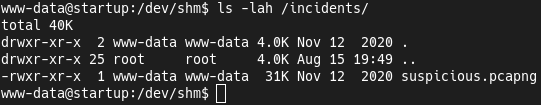  
  
The 177th packet contains the lennie's password.  
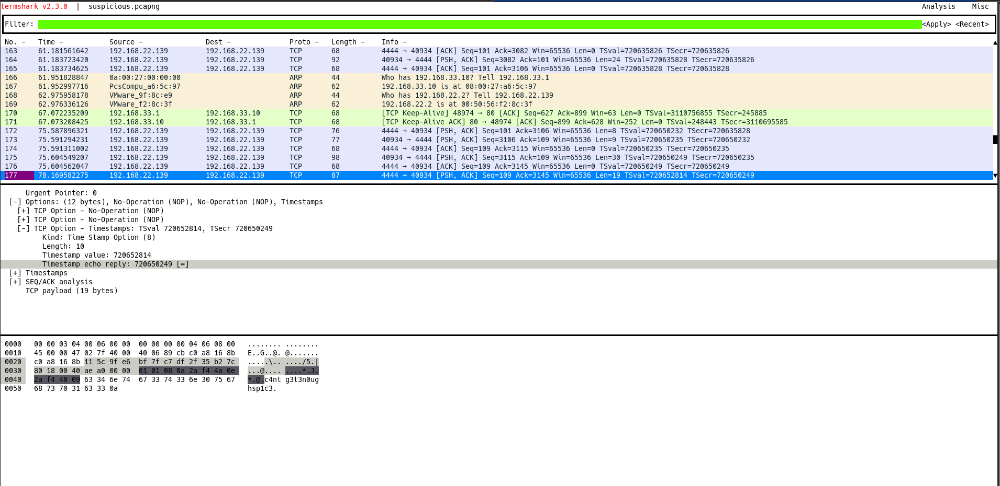  
  
In the home directory we have a `Documents`, `scripts` and user flag.  
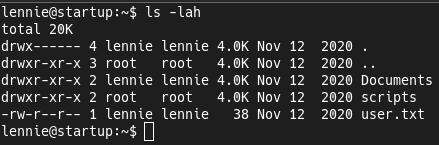  
  
Documents folder don't contains anything useful. 
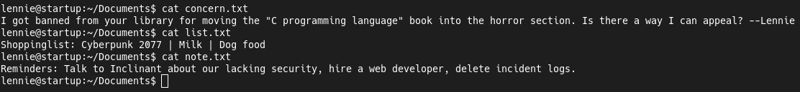  
  
But in the second directory we have a some script.  
It's owned by `root` user and executing the some another script.  
And this script owned by `lennie` user and we can write to it.  
Let's put the reverse shell to this script and start the new TCP listener.  
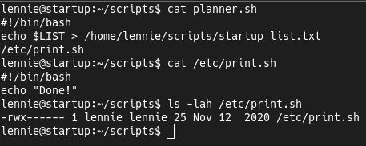  
  
After a few seconds we have a new connection with a root shell.  
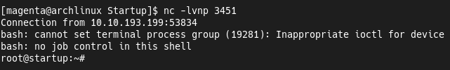  

### Conclusion
This machine shows us the some basic attack vectors.  
And it points us that enumeration stage is so important.
 
